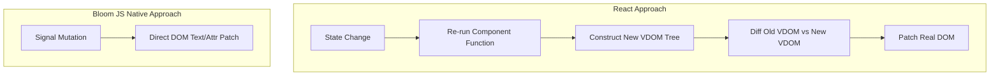

# 01 — Thinking in Signals & Pure Dart AST

Welcome to **Bloom JS Native**. If you are coming from React, Vue, Svelte, or Flutter Web, this guide will establish the core mental model that sets Bloom apart.

---

## 1. The Core Philosophy

React wrapped JavaScript around HTML with JSX and Virtual DOM.  
Flutter Web placed a CanvasKit/Skia rendering engine in WebAssembly.  
**Bloom JS Native wraps Dart around the Real DOM.**



### The Three Invariants
1. **Dart owns reactivity, compilation, and tooling**: Your code is written in strongly-typed, sound Dart with zero JSX, zero runtime dynamic code generation, and zero runtime template parsers.
2. **The Browser owns rendering**: No heavy 2MB WebAssembly rendering engines. Pure HTML elements, native CSS stylesheets, and hardware-accelerated SVG/WebGL.
3. **NPM is consumed surgically, never wholesale**: You can vendor and invoke any ESM library (Three.js, Chart.js, Confetti, Anime.js) with zero-cost `dart:js_interop` extension types.

---

## 2. Comparing Mental Models: VDOM vs Fine-Grained Signals

### React Component Lifecycle (Component-Level Reactivity)
In React, when a state variable changes, the **entire component function executes again from top to bottom**:

```tsx
// React 19
function Counter() {
  const [count, setCount] = useState(0);
  console.log("Entire Counter() function re-executed!"); // Prints on every click

  return (
    <div className="card">
      <h2>Count: {count}</h2>
      <button onClick={() => setCount(c => c + 1)}>Increment</button>
    </div>
  );
}
```

### Bloom JS Native Component Lifecycle (Node-Level Reactivity)
In Bloom, component functions execute **exactly once** during initial creation. Changing a signal value **never re-runs the component function**. It only updates the exact DOM text node attached to `Live()`:

```dart
// Bloom JS Native
BloomNode Counter() {
  final count = signal(0);
  print("Counter() executed ONCE at creation!"); // Prints only once!

  return Div(
    className: 'card',
    children: [
      Live(() => H2(text: 'Count: ${count.value}')), // Only this text updates
      Button(
        text: 'Increment',
        onClick: (_) => count.value++,
      ),
    ],
  );
}
```

---

## 3. The Pure Dart AST Descriptor Tree

Every UI element in Bloom is an immutable, tree-shakeable **AST descriptor** subclassing `BloomNode`:

```
BloomNode
├── ElNode (Div, Span, Button, Input, Form, H1-H6, Nav, Header, Section, ...)
├── TextNode (Text)
├── LiveNode (Live(() => ...))
├── ShowNode (Show(when: () => ..., child:, fallback:))
├── ForEachNode (ForEach(() => items, (item) => ...))
├── FragmentNode (Fragment.fromList([...]))
├── StyleNode (Style('...'))
└── RawHtmlNode (Raw('...'))
```

Because descriptors are pure Dart objects with **zero dependency on browser DOM APIs (`package:web` or `dart:html`)**, the same component tree can be executed across two distinct backends:

1. **Browser Backend (`package:bloom_js_native/browser.dart`)**:
   - Compiles to lightweight JavaScript (`dart compile js -O4`).
   - Mounts to real DOM elements (`mount(app, '#app')`).
   - Binds fine-grained `signals` effects with automatic scoped disposal (`_Region`).

2. **Server & SSR Backend (`renderToHtml()`)**:
   - Runs directly on the Dart Native VM or AOT server (`apps/server/bin/server.dart`).
   - Renders to high-throughput, XSS-escaped HTML strings in `<0.4ms` with zero browser overhead.

---

## 4. Next Steps

- Proceed to [02 — Describing the UI](./02_describing_the_ui.md) to master HTML element builders, attributes, and conditional/list rendering.
- Explore [03 — Reactivity & State](./03_reactivity_and_state.md) to understand Signals, Computed values, and Batching.
